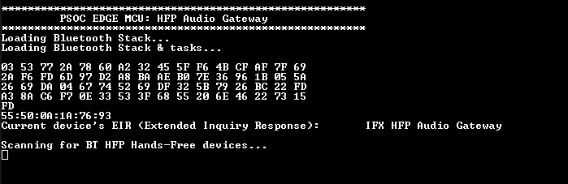
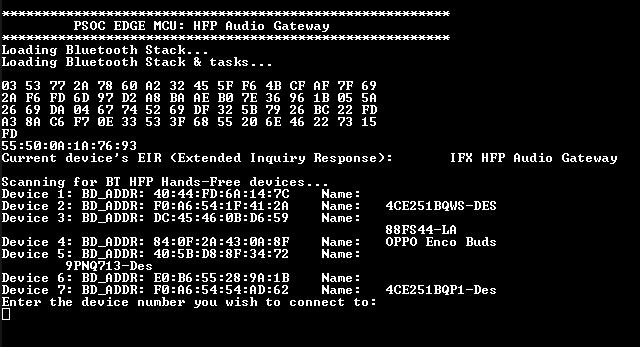
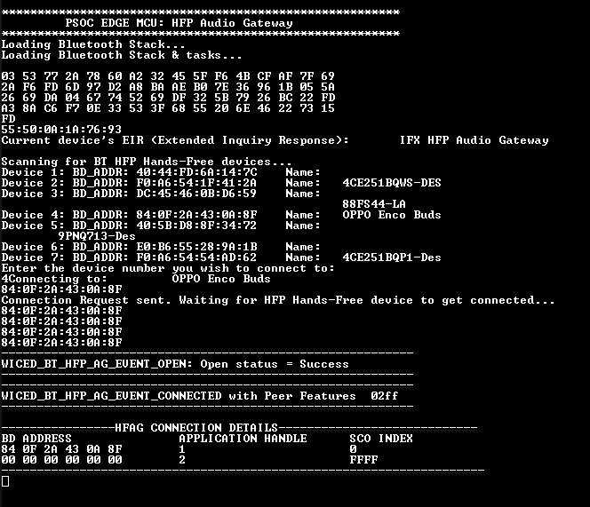
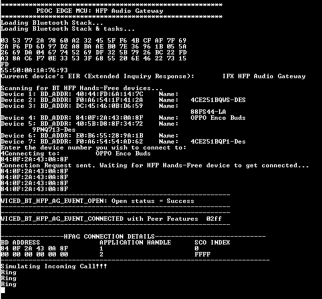
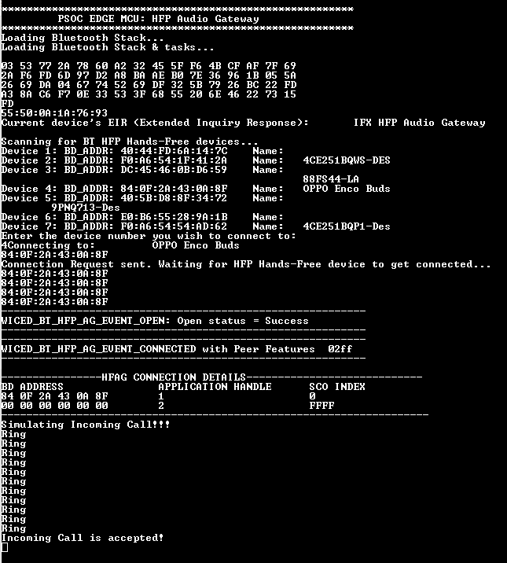
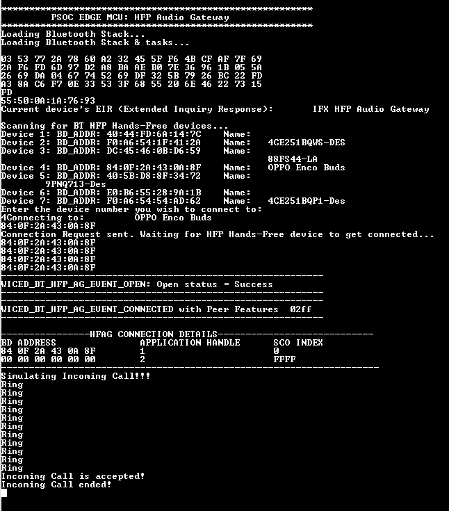
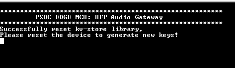

# PSOC&trade; Edge MCU: Bluetooth&reg; HFP audio gateway

This application demonstrates a hands-free profile (HFP) audio gateway (AG) using the AIROC&trade; Bluetooth&reg; stack. The application runs on the PSOC&trade; Edge E84 Evaluation Kit and appears as an HFP audio gateway device. A remote hands-free (HF) device, such as a Bluetooth&reg; headset or car kit, can connect to it for call control and audio streaming.

The HFP audio gateway implements basic telephonic simulation (e.g., call setup, call rejection) and audio gain control through onboard button actions.

This code example has a three-project structure – CM33 Secure, CM33 Non-Secure, and CM55 projects – similar to other Bluetooth&reg; audio applications. The Edge Protect Bootloader loads the application into SRAM and launches it.

See the [Design and implementation](docs/design_and_implementation.md) for the functional description of this code example.

## Requirements

- [ModusToolbox&trade;](https://www.infineon.com/modustoolbox) v3.7 or later (tested with v3.7)
- Board support package (BSP) minimum required version: 1.0.0
- Programming language: C
- Associated parts: All [PSOC&trade; Edge MCU](https://www.infineon.com/products/microcontroller/32-bit-psoc-arm-cortex/32-bit-psoc-edge-arm) parts

## Supported toolchains (make variable 'TOOLCHAIN')

- GNU Arm&reg; Embedded Compiler v14.2.1 (`GCC_ARM`) – Default value of `TOOLCHAIN`
- Arm&reg; Compiler v6.22 (`ARM`)
- IAR C/C++ Compiler v9.50.2 (`IAR`)

## Supported kits (make variable 'TARGET')

- [PSOC&trade; Edge E84 Evaluation Kit](https://www.infineon.com/KIT_PSE84_EVAL) (`KIT_PSE84_EVAL_EPC2`) – Default value of `TARGET`
- [PSOC&trade; Edge E84 Evaluation Kit](https://www.infineon.com/KIT_PSE84_EVAL) (`KIT_PSE84_EVAL_EPC4`)
- [PSOC&trade; Edge E84 HMI Kit](https://www.infineon.com/KIT_PSE84_HMI) (`KIT_PSE84_HMI`)

## Hardware setup

This example uses the board's default configuration. See the kit user guide to ensure that the board is configured correctly.

Ensure the following jumper and pin configuration on board:
- BOOT SW are in the HIGH/ON position
- J20 and J21 are in the tristate/not connected (NC) position for the PSOC&trade; Edge E84 Evaluation Kit

## Software setup

See the [ModusToolbox&trade; tools package installation guide](https://www.infineon.com/ModusToolboxInstallguide) for information about installing and configuring the tools package.

Install a terminal emulator if you do not have one. Instructions in this document use [Tera Term](https://teratermproject.github.io/index-en.html).

This example requires no additional software or tools.

## Operation

See [Using the code example](docs/using_the_code_example.md) for instructions on creating a project, opening it in various supported IDEs, and performing tasks, such as building, programming, and debugging the application within the respective IDEs.

1. Connect the board to your PC using the provided USB cable through the KitProg3 USB connector

2. Open a terminal program and select the KitProg3 COM port. Configure the serial port settings to 115200 baud, 8 data bits, no parity, and 1 stop bit (8N1)

3. Build and program the board with this application using ModusToolbox&trade;. After programming, the application starts automatically and displays the title "PSOC EDGE MCU: HFP Audio Gateway"

   **Figure 1. Terminal output after HFP AG startup**

    

4. The application initializes the Bluetooth&reg; stack and scans for available hands-free (HF) devices (e.g., OnePlus Nord buds, Galaxy buds). The Blue LED (User LED3) blinks to indicate that the device is ready to pair. Make sure the HF device is also in ready-to-pair mode

   **Figure 2. Terminal output after HFP AG scan**

    

5. In the serial terminal, type the number corresponding to the device you want to connect to and press Enter. When the connection is successful, the terminal displays “WICED_BT_HFP_AG_EVENT_CONNECTED”, and the Blue LED (User LED3) remains on

   **Figure 3. Terminal output after HF device connected** 

   

6. Press and hold USER_BTN1 (SW2) for more than two seconds to simulate an incoming call event (call from +<country_code><phone_number>)

   **Figure 4. Terminal output after HF device call simulation started** 

   

   **Note:** On some HF devices, call rings are notified using audio or LED indications 

7. Accept the call using the connected HF device

   **Figure 5. Terminal output after HF device simulated call accepted** 

   

8. Once the call is accepted, the voice audio from HF's mic can be heard on the EVK's speaker and the voice audio captured from EVK's mic can be heard on the HF's speaker

9. Press and hold USER_BTN2 (SW4) for more than two seconds to end an active call

   **Figure 6. Terminal output after HF device simulated call ended** 

   

10. Press and release USER_BTN1 (SW2) to increase the volume during an active call

11. Press and release USER_BTN2 (SW4) to decrease the volume during an active call

12. To clear previously stored bonding keys, press and hold USER_BTN1 (SW2), then press and release the reset (XRES) button. The terminal will confirm that the keys have been cleared. Press Reset once more to restart the application

   **Figure 7. Terminal output after clearing bonding keys**
   
    

## Related resources

Resources | Links
----------|--------------------------
Application notes  | [AN235935](https://www.infineon.com/AN235935) – Getting started with PSOC&trade; Edge E84 MCU on ModusToolbox&trade; software   [AN236697](https://www.infineon.com/AN236697) – Getting started with PSOC&trade; MCU and AIROC&trade; Connectivity devices
Code examples  | [Using ModusToolbox&trade;](https://github.com/Infineon/Code-Examples-for-ModusToolbox-Software) on GitHub
Device documentation | [PSOC&trade; Edge E84 MCU datasheet](https://www.infineon.com/products/microcontroller/32-bit-psoc-arm-cortex/32-bit-psoc-edge-arm/psoc-edge-e84#Documents)   [PSOC&trade; Edge E84 MCU reference manuals](https://www.infineon.com/products/microcontroller/32-bit-psoc-arm-cortex/32-bit-psoc-edge-arm/psoc-edge-e84#Documents)
Development kits | Select your kits from the [Evaluation board finder](https://www.infineon.com/cms/en/design-support/finder-selection-tools/product-finder/evaluation-board)
Libraries  | [mtb-dsl-pse8xxgp](https://github.com/Infineon/mtb-dsl-pse8xxgp) – Device support library for PSE8XXGP   [retarget-io](https://github.com/Infineon/retarget-io) – Utility library to retarget STDIO messages to a UART port    btstack – BTSTACK Library    btstack-integration - The btstack-integration hosts platform adaptation layer (porting layer) between AIROC&trade; BT Stack and Infineon's different hardware platforms.   kv-store - This library provides a convenient way to store information as key-value pairs in non-volatile storage
Tools  | [ModusToolbox&trade;](https://www.infineon.com/modustoolbox) – ModusToolbox&trade; software is a collection of easy-to-use libraries and tools enabling rapid development with Infineon MCUs for applications ranging from wireless and cloud-connected systems, edge AI/ML, embedded sense and control, to wired USB connectivity using PSOC&trade; Industrial/IoT MCUs, AIROC&trade; Wi-Fi and Bluetooth&reg; connectivity devices, XMC&trade; Industrial MCUs, and EZ-USB&trade;/EZ-PD&trade; wired connectivity controllers. ModusToolbox&trade; incorporates a comprehensive set of BSPs, HAL, libraries, configuration tools, and provides support for industry-standard IDEs to fast-track your embedded application development

 

## Other resources

Infineon provides a wealth of data at [www.infineon.com](https://www.infineon.com) to help you select the right device, and quickly and effectively integrate it into your design.

## Document history

Document title: CE242090 – PSOC&trade; Edge MCU: Bluetooth&reg; HFP audio gateway

Version | Description of change
------- | ---------------------
1.0.0   | New code example
1.1.0   | Added support for KIT_PSE84_HMI

 

All referenced product or service names and trademarks are the property of their respective owners.

The Bluetooth&reg; word mark and logos are registered trademarks owned by Bluetooth SIG, Inc., and any use of such marks by Infineon is under license.

PSOC&trade;, formerly known as PSoC&trade;, is a trademark of Infineon Technologies. Any references to PSoC&trade; in this document or others shall be deemed to refer to PSOC&trade;.

---------------------------------------------------------

© Cypress Semiconductor Corporation, 2025-2026. This document is the property of Cypress Semiconductor Corporation, an Infineon Technologies company, and its affiliates ("Cypress").  This document, including any software or firmware included or referenced in this document ("Software"), is owned by Cypress under the intellectual property laws and treaties of the United States and other countries worldwide.  Cypress reserves all rights under such laws and treaties and does not, except as specifically stated in this paragraph, grant any license under its patents, copyrights, trademarks, or other intellectual property rights.  If the Software is not accompanied by a license agreement and you do not otherwise have a written agreement with Cypress governing the use of the Software, then Cypress hereby grants you a personal, non-exclusive, nontransferable license (without the right to sublicense) (1) under its copyright rights in the Software (a) for Software provided in source code form, to modify and reproduce the Software solely for use with Cypress hardware products, only internally within your organization, and (b) to distribute the Software in binary code form externally to end users (either directly or indirectly through resellers and distributors), solely for use on Cypress hardware product units, and (2) under those claims of Cypress's patents that are infringed by the Software (as provided by Cypress, unmodified) to make, use, distribute, and import the Software solely for use with Cypress hardware products.  Any other use, reproduction, modification, translation, or compilation of the Software is prohibited.
 
TO THE EXTENT PERMITTED BY APPLICABLE LAW, CYPRESS MAKES NO WARRANTY OF ANY KIND, EXPRESS OR IMPLIED, WITH REGARD TO THIS DOCUMENT OR ANY SOFTWARE OR ACCOMPANYING HARDWARE, INCLUDING, BUT NOT LIMITED TO, THE IMPLIED WARRANTIES OF MERCHANTABILITY AND FITNESS FOR A PARTICULAR PURPOSE.  No computing device can be absolutely secure.  Therefore, despite security measures implemented in Cypress hardware or software products, Cypress shall have no liability arising out of any security breach, such as unauthorized access to or use of a Cypress product. CYPRESS DOES NOT REPRESENT, WARRANT, OR GUARANTEE THAT CYPRESS PRODUCTS, OR SYSTEMS CREATED USING CYPRESS PRODUCTS, WILL BE FREE FROM CORRUPTION, ATTACK, VIRUSES, INTERFERENCE, HACKING, DATA LOSS OR THEFT, OR OTHER SECURITY INTRUSION (collectively, "Security Breach").  Cypress disclaims any liability relating to any Security Breach, and you shall and hereby do release Cypress from any claim, damage, or other liability arising from any Security Breach.  In addition, the products described in these materials may contain design defects or errors known as errata which may cause the product to deviate from published specifications. To the extent permitted by applicable law, Cypress reserves the right to make changes to this document without further notice. Cypress does not assume any liability arising out of the application or use of any product or circuit described in this document. Any information provided in this document, including any sample design information or programming code, is provided only for reference purposes.  It is the responsibility of the user of this document to properly design, program, and test the functionality and safety of any application made of this information and any resulting product.  "High-Risk Device" means any device or system whose failure could cause personal injury, death, or property damage.  Examples of High-Risk Devices are weapons, nuclear installations, surgical implants, and other medical devices.  "Critical Component" means any component of a High-Risk Device whose failure to perform can be reasonably expected to cause, directly or indirectly, the failure of the High-Risk Device, or to affect its safety or effectiveness.  Cypress is not liable, in whole or in part, and you shall and hereby do release Cypress from any claim, damage, or other liability arising from any use of a Cypress product as a Critical Component in a High-Risk Device. You shall indemnify and hold Cypress, including its affiliates, and its directors, officers, employees, agents, distributors, and assigns harmless from and against all claims, costs, damages, and expenses, arising out of any claim, including claims for product liability, personal injury or death, or property damage arising from any use of a Cypress product as a Critical Component in a High-Risk Device. Cypress products are not intended or authorized for use as a Critical Component in any High-Risk Device except to the limited extent that (i) Cypress's published data sheet for the product explicitly states Cypress has qualified the product for use in a specific High-Risk Device, or (ii) Cypress has given you advance written authorization to use the product as a Critical Component in the specific High-Risk Device and you have signed a separate indemnification agreement.
 
Cypress, the Cypress logo, and combinations thereof, ModusToolbox, PSoC, CAPSENSE, EZ-USB, F-RAM, and TRAVEO are trademarks or registered trademarks of Cypress or a subsidiary of Cypress in the United States or in other countries. For a more complete list of Cypress trademarks, visit www.infineon.com. Other names and brands may be claimed as property of their respective owners.