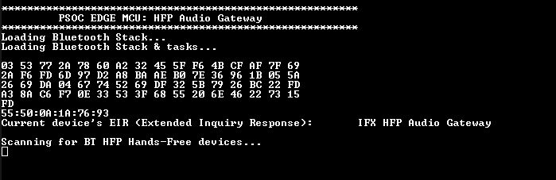
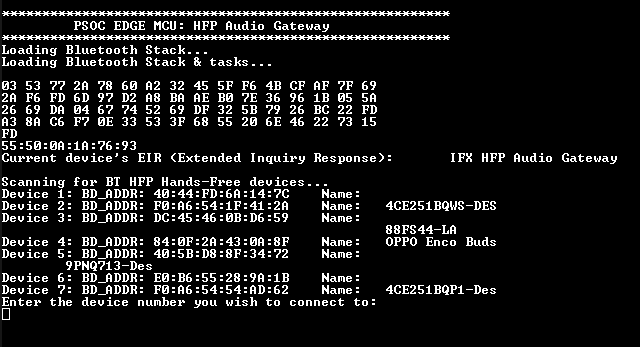
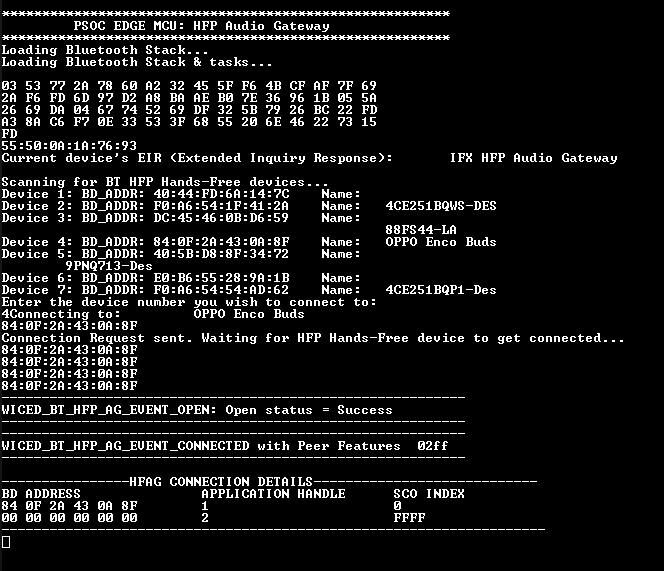
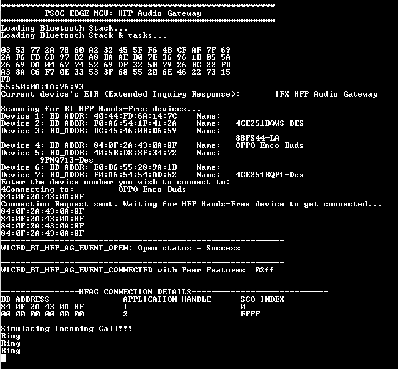
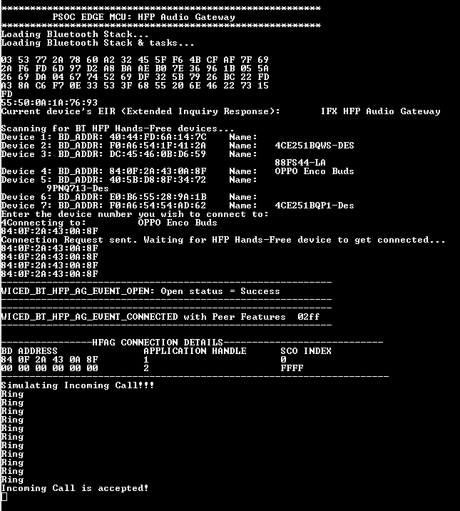
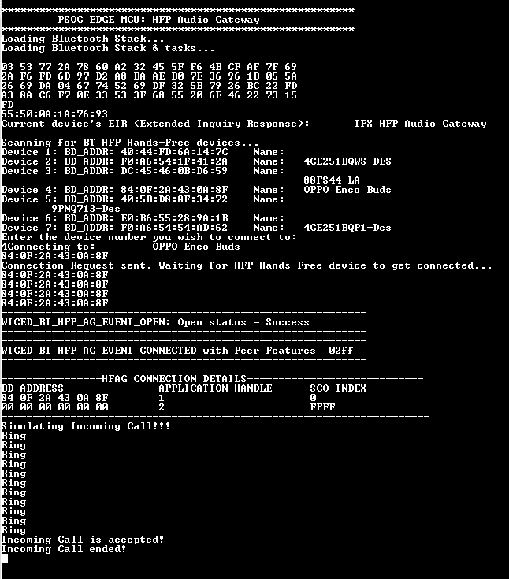
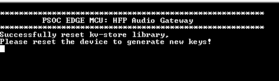

# PSOC&trade; Edge MCU: Bluetooth&reg; HFP audio gateway

This application demonstrates a hands-free profile (HFP) audio gateway (AG) using the AIROC&trade; Bluetooth&reg; stack. The application runs on the PSOC&trade; Edge E84 Evaluation Kit and appears as an HFP audio gateway device. A remote hands-free (HF) device, such as a Bluetooth&reg; headset or car kit, can connect to it for call control and audio streaming.

The HFP audio gateway implements basic telephonic simulation (e.g., call setup, call rejection) and audio gain control through onboard button actions.

This code example has a three-project structure – CM33 Secure, CM33 Non-Secure, and CM55 projects – similar to other Bluetooth&reg; audio applications. The Edge Protect Bootloader loads the application into SRAM and launches it.

See the [Design and implementation](docs/design_and_implementation.md) for the functional description of this code example.

## Requirements

- [ModusToolbox&trade;](https://www.infineon.com/modustoolbox) v3.7 or later (tested with v3.9)
- Board support package (BSP) minimum required version: 1.4.0
- Programming language: C
- Associated parts: All [PSOC&trade; Edge MCU](https://www.infineon.com/products/microcontroller/32-bit-psoc-arm-cortex/32-bit-psoc-edge-arm) parts

## Supported toolchains (make variable 'TOOLCHAIN')

- GNU Arm&reg; Embedded Compiler v14.2.1 (`GCC_ARM`) – Default value of `TOOLCHAIN`
- Arm&reg; Compiler v6.22 (`ARM`)
- IAR C/C++ Compiler v9.70.4 (`IAR`)

## Supported kits (make variable 'TARGET')

- [PSOC&trade; Edge E84 Evaluation Kit](https://www.infineon.com/KIT_PSE84_EVAL) (`KIT_PSE84_EVAL_EPC2`) – Default value of `TARGET`
- [PSOC&trade; Edge E84 Evaluation Kit](https://www.infineon.com/KIT_PSE84_EVAL) (`KIT_PSE84_EVAL_EPC4`)
- [PSOC&trade; Edge E84 HMI Kit](https://www.infineon.com/KIT_PSE84_HMI) (`KIT_PSE84_HMI`)

## Hardware setup

This example uses the board's default configuration. See the kit user guide to ensure that the board is configured correctly.

Ensure the following jumper and pin configuration on board:
- BOOT SW are in the HIGH/ON position
- J20 and J21 are in the tristate/not connected (NC) position for the PSOC&trade; Edge E84 Evaluation Kit

## Software setup

See the [ModusToolbox&trade; tools package installation guide](https://www.infineon.com/ModusToolboxInstallguide) for information about installing and configuring the tools package.

Install a terminal emulator if you do not have one. Instructions in this document use [Tera Term](https://teratermproject.github.io/index-en.html).

This example requires no additional software or tools.

## Operation

See [Using the code example](docs/using_the_code_example.md) for instructions on creating a project, opening it in various supported IDEs, and performing tasks, such as building, programming, and debugging the application within the respective IDEs.

1. Connect the board to your PC using the provided USB cable through the KitProg3 USB connector

2. Open a terminal program and select the KitProg3 COM port. Configure the serial port settings to 115200 baud, 8 data bits, no parity, and 1 stop bit (8N1)

3. Build and program the board with this application using ModusToolbox&trade;. After programming, the application starts automatically and displays the title "PSOC EDGE MCU: HFP Audio Gateway"

   **Figure 1. Terminal output after HFP AG startup**

    

4. The application initializes the Bluetooth&reg; stack and scans for available hands-free (HF) devices (e.g., OnePlus Nord buds, Galaxy buds). The Blue LED (User LED3) blinks to indicate that the device is ready to pair. Make sure the HF device is also in ready-to-pair mode

   **Figure 2. Terminal output after HFP AG scan**

    

5. In the serial terminal, type the number corresponding to the device you want to connect to and press Enter. When the connection is successful, the terminal displays “WICED_BT_HFP_AG_EVENT_CONNECTED”, and the Blue LED (User LED3) remains on

   **Figure 3. Terminal output after HF device connected** 

   

6. Press and hold USER_BTN1 (SW2) for more than two seconds to simulate an incoming call event (call from +<country_code><phone_number>)

   **Figure 4. Terminal output after HF device call simulation started** 

   

   **Note:** On some HF devices, call rings are notified using audio or LED indications 

7. Accept the call using the connected HF device

   **Figure 5. Terminal output after HF device simulated call accepted** 

   

8. Once the call is accepted, the voice audio from HF's mic can be heard on the EVK's speaker and the voice audio captured from EVK's mic can be heard on the HF's speaker

9. Press and hold USER_BTN2 (SW4) for more than two seconds to end an active call

   **Figure 6. Terminal output after HF device simulated call ended** 

   

10. Press and release USER_BTN1 (SW2) to increase the volume during an active call

11. Press and release USER_BTN2 (SW4) to decrease the volume during an active call

12. To clear previously stored bonding keys, press and hold USER_BTN1 (SW2), then press and release the reset (XRES) button. The terminal will confirm that the keys have been cleared. Press Reset once more to restart the application

   **Figure 7. Terminal output after clearing bonding keys**
   
    

## Related resources

Resources | Links
----------|--------------------------
Application notes  | [AN235935](https://www.infineon.com/AN235935) – Getting started with PSOC&trade; Edge E84 MCU on ModusToolbox&trade; software   [AN236697](https://www.infineon.com/AN236697) – Getting started with PSOC&trade; MCU and AIROC&trade; Connectivity devices
Code examples  | [Using ModusToolbox&trade;](https://github.com/Infineon/Code-Examples-for-ModusToolbox-Software) on GitHub
Device documentation | [PSOC&trade; Edge E84 MCU datasheet](https://www.infineon.com/products/microcontroller/32-bit-psoc-arm-cortex/32-bit-psoc-edge-arm/psoc-edge-e84#Documents)   [PSOC&trade; Edge E84 MCU reference manuals](https://www.infineon.com/products/microcontroller/32-bit-psoc-arm-cortex/32-bit-psoc-edge-arm/psoc-edge-e84#Documents)
Development kits | Select your kits from the [Evaluation board finder](https://www.infineon.com/cms/en/design-support/finder-selection-tools/product-finder/evaluation-board)
Libraries  | [mtb-dsl-pse8xxgp](https://github.com/Infineon/mtb-dsl-pse8xxgp) – Device support library for PSE8XXGP   [retarget-io](https://github.com/Infineon/retarget-io) – Utility library to retarget STDIO messages to a UART port    btstack – BTSTACK Library    btstack-integration - The btstack-integration hosts platform adaptation layer (porting layer) between AIROC&trade; BT Stack and Infineon's different hardware platforms.   kv-store - This library provides a convenient way to store information as key-value pairs in non-volatile storage
Tools  | [ModusToolbox&trade;](https://www.infineon.com/modustoolbox) – ModusToolbox&trade; software is a collection of easy-to-use libraries and tools enabling rapid development with Infineon MCUs for applications ranging from wireless and cloud-connected systems, edge AI/ML, embedded sense and control, to wired USB connectivity using PSOC&trade; Industrial/IoT MCUs, AIROC&trade; Wi-Fi and Bluetooth&reg; connectivity devices, XMC&trade; Industrial MCUs, and EZ-USB&trade;/EZ-PD&trade; wired connectivity controllers. ModusToolbox&trade; incorporates a comprehensive set of BSPs, HAL, libraries, configuration tools, and provides support for industry-standard IDEs to fast-track your embedded application development

 

## Other resources

Infineon provides a wealth of data at [www.infineon.com](https://www.infineon.com) to help you select the right device, and quickly and effectively integrate it into your design.

## Document history

Document title: CE242090 – PSOC&trade; Edge MCU: Bluetooth&reg; HFP audio gateway

Version | Description of change
------- | ---------------------
1.0.0   | New code example
1.1.0   | Added support for KIT_PSE84_HMI
1.2.0   | Updated to support btstack-integration v7.X   ECO configurations update for KIT_PSE84_HMI

 

All referenced product or service names and trademarks are the property of their respective owners.

The Bluetooth&reg; word mark and logos are registered trademarks owned by Bluetooth SIG, Inc., and any use of such marks by Infineon is under license.

PSOC&trade;, formerly known as PSoC&trade;, is a trademark of Infineon Technologies. Any references to PSoC&trade; in this document or others shall be deemed to refer to PSOC&trade;.

---------------------------------------------------------

(c) 2025-2026, Infineon Technologies AG, or an affiliate of Infineon Technologies AG. All rights reserved.
This software, associated documentation and materials ("Software") is owned by Infineon Technologies AG or one of its affiliates ("Infineon") and is protected by and subject to worldwide patent protection, worldwide copyright laws, and international treaty provisions. Therefore, you may use this Software only as provided in the license agreement accompanying the software package from which you obtained this Software. If no license agreement applies, then any use, reproduction, modification, translation, or compilation of this Software is prohibited without the express written permission of Infineon.
 
Disclaimer: UNLESS OTHERWISE EXPRESSLY AGREED WITH INFINEON, THIS SOFTWARE IS PROVIDED AS-IS, WITH NO WARRANTY OF ANY KIND, EXPRESS OR IMPLIED, INCLUDING, BUT NOT LIMITED TO, ALL WARRANTIES OF NON-INFRINGEMENT OF THIRD-PARTY RIGHTS AND IMPLIED WARRANTIES SUCH AS WARRANTIES OF FITNESS FOR A SPECIFIC USE/PURPOSE OR MERCHANTABILITY. Infineon reserves the right to make changes to the Software without notice. You are responsible for properly designing, programming, and testing the functionality and safety of your intended application of the Software, as well as complying with any legal requirements related to its use. Infineon does not guarantee that the Software will be free from intrusion, data theft or loss, or other breaches (“Security Breaches”), and Infineon shall have no liability arising out of any Security Breaches. Unless otherwise explicitly approved by Infineon, the Software may not be used in any application where a failure of the Product or any consequences of the use thereof can reasonably be expected to result in personal injury.
